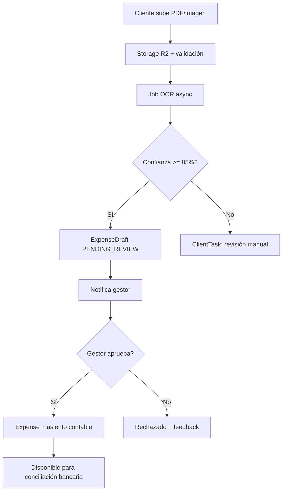

# RDPR OS — Product Blueprint

**Sistema operativo con IA para gestorías y asesorías**

Documento de diseño estratégico y técnico · Versión 1.0 · RDPR Digital S.L.

| Rol | Contribución |
|-----|--------------|
| CTO | Arquitectura, stack, escalabilidad |
| Product Manager | Roadmap, MVP, pricing, GTM |
| Arquitecto de software | Multi-tenant, datos, integraciones |
| UX/UI | Panel gestoría + portal cliente |
| Experto IA | Agentes, OCR, automatización |
| Seguridad | RBAC, RGPD, cifrado, auditoría |
| B2B SaaS | Planes, unit economics, retención |

---

## Resumen ejecutivo

**RDPR OS** es una plataforma SaaS B2B2B donde las gestorías y asesorías pagan una suscripción mensual y gestionan a todos sus clientes (autónomos y empresas) desde un único panel, con un portal para el cliente final y capas de IA que automatizan el trabajo administrativo repetitivo.

**Visión (12 meses):** *El sistema donde una gestoría gestiona clientes, documentos, fiscal, banca y comunicación en un solo lugar — con IA que lee facturas, organiza tareas y responde al cliente, y un portal donde el autónomo sube documentación, firma y conecta su banco sin depender del teléfono.*

**No es:** un gestor documental, un ERP genérico ni un clon de software de escritorio.

**Es:** la capa operativa entre Hacienda, bancos, clientes y el despacho.

---

## 1. Modelo multi-tenant SaaS

### 1.1 Jerarquía de negocio (B2B2B)

```
RDPR (Plataforma SaaS — cobra suscripción)
│
├── Gestoría A                    ← Tenant pagador (Firm)
│   ├── Usuarios internos         ← Contable, fiscal, admin, socio…
│   └── Clientes finales          ← Autónomos, SL, SA…
│       └── Usuarios portal       ← Acceso del cliente al portal
│
├── Gestoría B
│   └── …
```

**Regla de negocio:** la gestoría paga RDPR. El cliente final no paga la plataforma (salvo acuerdos white-label Enterprise).

### 1.2 Modelo de datos (4 capas)

| Capa | Entidad | Descripción |
|------|---------|-------------|
| **L0 Plataforma** | `Platform` | Config global, billing Stripe, feature flags |
| **L1 Tenant** | `Firm` | Gestoría/asesoría suscriptora |
| **L2 Usuarios despacho** | `FirmUser` + `Role` | Empleados con permisos granulares |
| **L3 Cliente final** | `Client` + `ClientProfile` | Expediente fiscal/legal |
| **L4 Portal** | `PortalUser` / `ClientPortalAccess` | Acceso del cliente al portal |

### 1.3 Estado actual vs objetivo (RDPR)

| Hoy | Objetivo |
|-----|----------|
| `Organization → Company → Customer` | `Platform → Firm → Client` |
| `Company` mezcla tenant + contabilidad del despacho | `Firm` explícito como frontera de billing y aislamiento |
| Multi-tenant por `companyId` | Multi-tenant por `firmId` + RLS en fase growth |

### 1.4 Aislamiento de datos

| Fase | Estrategia | Cuándo |
|------|------------|--------|
| **MVP** | `firmId` en todas las tablas + middleware + tests CI | 0–500 gestorías |
| **Growth** | PostgreSQL Row Level Security (Supabase) | 500–5.000 |
| **Enterprise** | Schema o DB dedicada por tenant grande | Top 20 clientes |

**Regla técnica:** ninguna query sin `firmId` del JWT de sesión. Nunca confiar en IDs enviados por el cliente sin validar pertenencia al tenant.

```typescript
// Patrón obligatorio en API routes
const firmId = session.firmId // del token, no del body
await prisma.client.findMany({ where: { firmId, ...filters } })
```

### 1.5 Storage multi-tenant

```
s3://bucket/{firmId}/{clientId}/{documentId}/{filename}
```

- Presigned URLs para upload directo (API no transporta binarios).
- Políticas IAM por prefijo `firmId`.
- Lifecycle rules: archivar expedientes cerrados > 6 años.

---

## 2. Experiencia de usuario

### 2.1 Panel de gestoría (back-office)

#### Information architecture

```
Inicio (Centro de mando)
├── Expedientes (CRM 360°)
│   ├── Resumen
│   ├── Perfil fiscal
│   ├── Fiscal / vencimientos
│   ├── Tareas
│   ├── Incidencias
│   ├── Documentos
│   ├── Facturas*
│   ├── Mensajes
│   └── Portal / invitación
├── Bandeja IA (revisión OCR, alertas)
├── Fiscal (modelos, calendario, presentaciones)
├── Contabilidad (diario, gastos, conciliación)
├── Documentos (vista global)
├── Firmas
├── Intelligence (chat + consultas)
├── Payroll / Legal / Compliance
├── Equipo y permisos
└── Ajustes / facturación SaaS
```

*Facturación del despacho a sus clientes ≠ suscripción RDPR.*

#### Dashboard — widgets obligatorios

| Widget | Fuente de datos | Acción principal |
|--------|-------------------|------------------|
| Clientes activos | `Client` con pipeline WON | Ir a CRM |
| Documentos pendientes revisión | `ExpenseDraft` + uploads portal | Bandeja IA |
| Alertas IA / operativas | reglas + agentes | Drill-down |
| Vencimientos fiscales (7/30 días) | calendario AEAT por perfil | Tab fiscal expediente |
| Tareas vencidas | `ClientTask` | CRM tareas |
| Salud expedientes | score compuesto | Semáforo por cliente |
| Docs portal (30 días) | `Document` source=PORTAL | Documentos |

**Implementado (Fase 1):** centro de mando gestoría, expediente 360 con tabs perfil/fiscal/tareas/incidencias.

### 2.2 Portal cliente (front-office)

#### Jobs-to-be-done del autónomo/empresa

1. Subir facturas sin conocer contabilidad.
2. Firmar autorización para actuar en su nombre (una vez).
3. Ver qué documentación falta y qué vencimientos vienen.
4. Comunicarse con la gestoría sin email.
5. Conectar banco para conciliación (cuando esté disponible).

#### Flujo de navegación

```
Login → Onboarding (si incompleto) → Home
├── Documentos (+ selector de carpeta)
├── Firmas pendientes
├── Resumen fiscal (orientativo)
├── Banco
├── Mensajes
├── Ayuda / FAQ
└── (futuro) Mis tareas
```

#### Principios UX

- **Mobile-first:** el autónomo sube fotos de facturas desde el móvil.
- **Máximo 3 clics** para subir un documento.
- Lenguaje humano, sin jerga contable.
- Progreso visible: *"Te falta: DNI, firma, 2 facturas de enero"*.
- Onboarding guiado antes del uso libre del portal.

**Implementado (Fases 2–5):** wizard onboarding, firmas, banco manual (IBAN), FAQ, carpetas en upload, mensajes.

---

## 3. Inteligencia artificial

### 3.1 Arquitectura de agentes

No un chat genérico: **orquestador + agentes especializados + tools acotados al tenant**.

```
                    ┌─────────────────┐
                    │  Orchestrator   │
                    │  (router LLM)   │
                    └────────┬────────┘
         ┌───────────────────┼───────────────────┐
         ▼                   ▼                   ▼
  ┌─────────────┐    ┌─────────────┐    ┌─────────────┐
  │ Doc Agent   │    │ Accounting  │    │ Admin Agent │
  │ OCR+classify│    │ Agent       │    │ tasks+email │
  └─────────────┘    └─────────────┘    └─────────────┘
         │                   │                   │
         └───────────────────┴───────────────────┘
                             ▼
                    Tools (tenant-scoped)
                    ├── query_clients
                    ├── query_invoices
                    ├── query_tax_filings
                    ├── query_vat_summary
                    ├── create_task
                    ├── request_document
                    └── search_documents (RAG)
```

### 3.2 Agentes especializados

| Agente | Input | Output | Human-in-the-loop |
|--------|-------|--------|-------------------|
| **IA documental** | PDF, imagen | JSON estructurado + categoría + score confianza | Obligatorio si confianza < 85% |
| **IA contable** | borrador OCR + movimiento banco | propuesta gasto / match / asiento borrador | Gestor aprueba siempre |
| **IA administrativa** | calendario + checklist + reglas | tareas + emails recordatorio | Configurable por gestoría |
| **IA asistente** | pregunta NL del cliente | respuesta con datos reales (tools + RAG) | Solo datos del `clientId` autenticado |

### 3.3 Stack IA recomendado

| Capa | MVP | Escala |
|------|-----|--------|
| OCR | Heurísticas + Tesseract / Google Vision | Azure Doc Intelligence / AWS Textract |
| Extracción estructurada | LLM + JSON schema (vendor, base, IVA, total) | Fine-tune facturas ES |
| Clasificación documental | Reglas + LLM | Embeddings + clasificador |
| Asistente gestoría | Tools SQL predefinidos (Intelligence v0) | RAG sobre docs expediente (pgvector) |
| Asistente portal | FAQ keyword + tools scoped | LLM + RAG cliente |
| Orquestación | Cola inline → Inngest | Workers dedicados |

### 3.4 Ejemplo: pregunta del cliente

> *"¿Cuánto IVA tengo este trimestre?"*

```
1. Auth portal → clientId en scope estricto
2. Tool: get_vat_summary(clientId, trimestre actual)
3. SQL: facturas emitidas + gastos con IVA del trimestre
4. LLM formatea respuesta legible
5. Disclaimer: "Orientativo — su gestor confirma la cifra oficial"
6. Log en audit trail
```

**Regla legal:** el LLM nunca calcula impuestos sin tool. Alucinación = responsabilidad civil/penal.

**Estado RDPR:** Intelligence v0 (~18 queries SQL). OCR heurístico + bandeja revisión. Pendiente: Vision API, RAG, orquestador.

---

## 4. Automatización de flujos

### 4.1 Workflow principal: factura subida



### 4.2 Workflows adicionales (prioridad producto)

| # | Trigger | Automatización |
|---|---------|----------------|
| 1 | Alta cliente en CRM | Perfil + carpetas + checklist + tareas onboarding |
| 2 | Invitación portal enviada | Email + checklist item `portal` ✓ |
| 3 | Doc subido en carpeta Identidad | OCR DNI + checklist `identity` |
| 4 | Firma completada (webhook) | `AuthorizationGrant` ACTIVE + checklist `authorization` |
| 5 | IBAN registrado en portal | checklist `bank` + tarea conciliación |
| 6 | Vencimiento fiscal -7 días | Email gestor + `ClientTask` TAX_FILING |
| 7 | Mensaje portal sin leer 24h | Email gestor |
| 8 | Movimiento banco ≈ factura (±€0.02) | Sugerencia match en UI conciliación |
| 9 | Modelo AEAT presentado | Notifica cliente + doc en expediente |
| 10 | Incidencia severity CRITICAL | Alerta centro de mando + escalado |

**Motor recomendado:** [Inngest](https://www.inngest.com) (compatible Vercel) o Temporal (equipo > 5 devs).

---

## 5. Firma digital

### 5.1 Casos de uso

| Documento | Nivel legal | Proveedor típico |
|-----------|-------------|------------------|
| Autorización representación (AEAT, SS) | Firma avanzada | Signaturit, Lleida.net |
| Contratos mercantiles | Avanzada / cualificada | Signaturit, DocuSign |
| Cliente sector público | @firma / certificado FNMT | Caso a caso |

### 5.2 Modelo de datos

```
SignatureRequest
├── firmId, clientId, documentId
├── provider (signaturit | lleida | stub)
├── externalId, signingUrl
├── status, signedAt, expiresAt
└── AuthorizationGrant
    ├── scopes: AEAT_PRESENT | SS_MANAGE | BANK_READ | FULL_REPRESENTATION
    ├── status: PENDING | ACTIVE | REVOKED
    └── grantedAt

SignatureEvidence (almacenamiento WORM)
├── hash SHA-256 documento firmado
├── timestamp, certificado
└── audit trail inmutable
```

### 5.3 Flujo

1. Gestoría genera PDF desde plantilla Legal (o documento subido).
2. API crea `SignatureRequest` + `AuthorizationGrant` PENDING.
3. Cliente recibe enlace en portal (Signaturit o simulación dev).
4. Webhook `signed` → grant ACTIVE → checklist ✓ → tarea onboarding completada.
5. PDF firmado en R2 (prefijo WORM) + hash en DB.

**Estado RDPR:** integración Signaturit preparada (`SIGNATURIT_API_KEY`). Modo simulación en portal sin clave.

---

## 6. Bancos y Open Banking

### 6.1 Arquitectura PSD2

```
Cliente autoriza en portal
    → Agregador (Tink / Nordigen / Plaid EU)
    → Token consent (90 días, renovable)
    → Worker sync cada 6–24h
    → BankTransaction (clientId scoped)
    → Motor match: importe ± tolerancia + ventana fechas + vendor fuzzy
    → UI conciliación gestor
```

### 6.2 Modelo de datos

```
ClientBankConnection
├── firmId, clientId
├── provider (manual | tink | nordigen)
├── externalId, consentExpiresAt
├── iban (masked en UI), bankName
├── status: PENDING | CONNECTED | EXPIRED | REVOKED
└── lastSyncAt

BankTransaction
├── firmId, clientId, bankConnectionId
├── amount, date, description, reference
├── matchedExpenseId?, matchedDocumentId?
└── status: UNMATCHED | MATCHED | IGNORED
```

**Estado RDPR:** IBAN manual en portal (`ClientBankConnection`). Conciliación CSV a nivel despacho. PSD2 = Fase 2 roadmap.

---

## 7. Base de datos — modelo completo

### 7.1 Entidades core

| Dominio | Tablas |
|---------|--------|
| **Plataforma** | Platform, Firm, FirmSubscription, FirmUser, Role, Permission |
| **Clientes** | Client, ClientProfile, ClientPortalAccess |
| **Documentos** | Document, DocumentFolder, DocumentOcrResult, OcrJob |
| **Contabilidad** | ExpenseDraft, Expense, ChartOfAccount, JournalEntry, JournalLine |
| **Facturación** | Invoice, InvoiceItem (scope: cliente o despacho — definir) |
| **Fiscal** | AeatTaxFiling, CompanyVerifactuConfig, VerifactuRegistryEntry |
| **Operaciones** | ClientTask, ClientIncident |
| **Legal** | SignatureRequest, AuthorizationGrant, LegalCase, LegalTemplate |
| **Banca** | ClientBankConnection, BankAccount, BankTransaction |
| **Laboral** | Employee, PayrollRun, PayrollLine |
| **Compliance** | DataProcessingRecord, DataSubjectRequest, ActivityLog, AuditLog |

### 7.2 Índices críticos (escala millones de documentos)

```sql
-- Siempre firmId primero en índices compuestos
CREATE INDEX idx_clients_firm ON clients(firm_id, pipeline_stage);
CREATE INDEX idx_docs_firm_client ON documents(firm_id, client_id, created_at DESC);
CREATE INDEX idx_tasks_firm_status ON client_tasks(firm_id, status, due_date);
CREATE UNIQUE INDEX idx_ocr_job_doc ON ocr_jobs(document_id);
CREATE UNIQUE INDEX idx_expense_draft_doc ON expense_drafts(document_id);
```

### 7.3 Retención y archivo

| Tipo | Retención legal ES | Acción |
|------|-------------------|--------|
| Documentos fiscales | 6 años | Archivo cold storage |
| Audit logs | 7 años | Append-only, no DELETE |
| Docs portal temporales | 90 días sin clasificar | Alerta gestor |

---

## 8. Tecnología

### 8.1 Stack recomendado (alineado con RDPR)

| Capa | Tecnología | Justificación |
|------|------------|---------------|
| **Frontend** | Next.js 14 App Router + React + Tailwind | Marketing + dashboard + portal unificados |
| **UI** | Design system propio (RDPR) | Consistencia gestoría/portal |
| **API** | Route Handlers → REST v1 / tRPC v2 | MVP actual OK |
| **ORM** | Prisma 5 | Type-safe, migraciones |
| **DB** | PostgreSQL (Supabase) | Relacional fuerte para fiscal |
| **Storage** | Cloudflare R2 / S3 | Coste predecible, millones de objetos |
| **Cola** | Inngest | OCR, sync banco, emails, cron |
| **IA** | OpenAI / Anthropic + tools | Structured outputs |
| **OCR** | Google Vision → Document AI | Precisión facturas ES |
| **Vector / RAG** | pgvector en Postgres | Sin servicio adicional |
| **Email** | Resend | Transaccional |
| **Pagos SaaS** | Stripe Billing | Planes + usage-based |
| **Hosting** | Vercel (app) + Fly.io (workers pesados) | MVP → scale |
| **Observabilidad** | Sentry + Axiom | Errores + latencia OCR |

### 8.2 Escalabilidad — millones de documentos

1. **Upload directo** a R2 con presigned URLs.
2. **OCR siempre async** — nunca en request HTTP síncrono.
3. **Thumbnails** generados en worker (pdf → webp).
4. **CDN** delante de R2 para descargas frecuentes.
5. **Lifecycle S3:** docs > 2 años → Glacier; > 6 años → archivo legal.
6. **Read replicas** Postgres para reporting e Intelligence.

### 8.3 Evolución arquitectónica

```
Fase MVP     → Monolito Next.js modular
Fase Growth  → Workers (Inngest) + read replicas
Fase Scale   → API pública + event bus + cache Redis
Enterprise   → Dedicated DB option + SSO SAML
```

---

## 9. Seguridad empresarial

### 9.1 RBAC — roles gestoría

| Rol | Permisos |
|-----|----------|
| **Owner** | Billing, usuarios, configuración, todo el dato |
| **Admin** | Usuarios, config — sin billing |
| **Contable** | Expedientes, gastos, banca, aprobar OCR |
| **Fiscal** | Modelos AEAT, presentaciones, calendario |
| **Laboral** | Nóminas, Seguridad Social |
| **Asistente** | Documentos, tareas, mensajes — sin presentar AEAT |
| **Solo lectura** | Auditor interno, socio no operativo |

### 9.2 Portal cliente

- Scope estricto: solo `clientId` del token JWT.
- Sin acceso cruzado entre clientes de la misma gestoría.
- Rate limiting en upload (ej. 50 archivos/hora/cliente).
- Validación MIME + tamaño máximo (ej. 25 MB).

### 9.3 Cifrado y protección de datos

| Dato | Tratamiento |
|------|-------------|
| Documentos sensibles | AES-256-GCM at rest (secure-upload) |
| IBAN | Almacenado encriptado; masked en UI (ES************1234) |
| Passwords | bcrypt cost factor 12 |
| Tokens banco PSD2 | Vault / env encriptado, rotación |
| Audit trail | Append-only, retención 7 años |
| Backups | Diarios Supabase + test restore mensual |

### 9.4 RGPD

- RDPR actúa como **encargado del tratamiento**; la gestoría es **responsable**.
- `DataProcessingRecord` por actividad (ya en schema).
- `DataSubjectRequest` para derechos ARSOPL (acceso, supresión, portabilidad).
- DPA (Data Processing Agreement) firmado con cada gestoría en onboarding SaaS.
- Registro de accesos a documentos por usuario + timestamp.

### 9.5 Riesgos inaceptables

1. Fuga de datos entre tenants.
2. IA presenta impuestos sin revisión humana.
3. Firma sin validez legal demostrable.
4. Backups sin restore probado.
5. Logs de auditoría editables o borrables.

---

## 10. Plan de desarrollo

### 10.1 Estado actual RDPR (referencia interna)

| Área | Completitud estimada |
|------|---------------------|
| Multi-tenant base (`companyId`) | ~70% |
| Expediente 360 + centro de mando | ~85% |
| Portal + onboarding + firma stub | ~75% |
| OCR + bandeja revisión | ~50% |
| Intelligence (queries SQL) | ~40% |
| Banca cliente PSD2 | ~15% |
| AEAT presentación real | ~20% |
| Billing enforcement por plan | ~10% |

### 10.2 FASE 1 — MVP comercial (meses 0–4)

**Objetivo:** *"Dejo de perseguir documentos por WhatsApp."*

| Entregable | Prioridad |
|------------|-----------|
| `Firm` explícito como tenant + RBAC básico | P0 |
| Expediente 360 completo | ✅ Hecho |
| Portal: docs + mensajes + onboarding | ✅ Hecho |
| Firma autorización Signaturit producción | P0 |
| OCR factura → bandeja → gasto aprobado | P0 |
| Centro de mando gestoría | ✅ Hecho |
| Stripe: 1 plan cobrando + límite clientes | P0 |
| Tests aislamiento tenant en CI | P0 |

**Métrica éxito:** 3–5 gestorías pagando · >50 clientes finales en portal · >200 docs/mes procesados.

**Fuera de scope Fase 1:** Open Banking, AEAT telemático real, mercantil, API pública.

### 10.3 FASE 2 — Product-market fit (meses 4–10)

- PSD2 por cliente (Tink / Nordigen).
- AEAT presentación asistida con certificado FNMT.
- Agentes IA admin (recordatorios automáticos de documentación).
- RAG asistente portal (*"¿cuánto IVA tengo?"*).
- Planes Starter / Professional con enforcement en código.
- PWA portal mobile.
- Verifactu producción.

**Métrica:** 20+ gestorías · NRR > 100% · churn mensual < 3%.

### 10.4 FASE 3 — Plataforma completa (meses 10–24)

- API REST + webhooks Enterprise.
- Multi-sede / franquicias de gestoría.
- Módulo mercantil (libros, actas, registros).
- Marketplace integraciones (export Holded, Sage, A3).
- White-label portal (dominio gestoría).
- Camino SOC 2 / ISO 27001.

**Métrica:** ARR €500K+ · LTV/CAC > 3 · equipo 8–12 personas.

---

## 11. Modelo de negocio

### 11.1 Planes y pricing (España 2026)

| Plan | Precio/mes | Clientes finales | Usuarios | OCR / mes | IA | Banco | Firmas/mes |
|------|------------|------------------|----------|-----------|-----|-------|------------|
| **Starter** | €79 | 25 | 2 | 100 docs | Básica | CSV import | 5 |
| **Professional** | €199 | 100 | 5 | 500 docs | Completa + Intelligence | PSD2 | 30 |
| **Enterprise** | €499+ | Ilimitado* | Ilimitado | Ilimitado | + API + agentes | Multi-cuenta | Ilimitado |

*Fair use. Custom pricing > 500 clientes finales.*

### 11.2 Add-ons (margen alto)

| Add-on | Precio |
|--------|--------|
| Cliente extra | €2–3/mes |
| Paquete OCR +500 docs | €29/mes |
| Sede adicional | €99/mes |
| Onboarding gestoría (one-time) | €500 |
| White-label portal | €200/mes |

### 11.3 Unit economics objetivo

| Métrica | Objetivo |
|---------|----------|
| CAC gestoría | €800–1.500 |
| LTV 36 meses (Pro) | ~€7.200 |
| Gross margin | > 75% |
| Payback CAC | < 12 meses |
| Churn mensual (Pro) | < 3% |

### 11.4 Enforcement técnico de planes

```typescript
// Middleware / service layer
async function assertWithinPlanLimits(firmId: string, action: 'create_client' | 'ocr' | 'signature') {
  const sub = await getSubscription(firmId)
  const usage = await getMonthlyUsage(firmId)
  if (usage.clients >= sub.limits.maxClients) throw new PlanLimitError('CLIENTS')
  // ...
}
```

---

## 12. Go-to-market y competencia

### 12.1 Posicionamiento

> **"El portal que tus clientes usan de verdad + la IA que lee sus facturas — no otro ERP."**

RDPR OS no compite head-to-head con A3 Contabilidad o Sage en contabilidad pura. Compite en **experiencia cliente + automatización documental + operativa del despacho**.

### 12.2 vs software tradicional

| Software tradicional | RDPR OS |
|---------------------|---------|
| Licencia + instalación | SaaS cloud, updates semanales |
| UI desktop años 2000 | Portal mobile-first moderno |
| Sin portal cliente real | B2B2B nativo desde diseño |
| OCR = módulo caro aparte | IA incluida en plan Pro |
| Precio opaco por puesto | €79–199/m predecible |
| Meses de implantación | Onboarding gestoría en días |

### 12.3 Primeros clientes (GTM)

1. **Dogfooding:** RDPR Digital como primera gestoría tenant en producción.
2. **5 gestorías locales** (Andalucía) — demo 30 min con expediente real.
3. **Oferta piloto:** 3 meses Professional a €99/m + onboarding incluido.
4. **Canales:** asociaciones de gestores, LinkedIn (founders gestoría), referidos de pilotos.
5. **Prueba social:** métricas públicas — *"X facturas procesadas, Y horas ahorradas por gestoría"*.

### 12.4 Errores a evitar

1. Construir "Odoo para gestorías" antes de tener 5 clientes pagando.
2. IA fiscal sin human-in-the-loop.
3. Mezclar contabilidad interna del despacho con expediente del cliente final.
4. Ignorar mobile en portal (80% uploads desde móvil).
5. Vender Enterprise antes de cerrar pilotos Starter.
6. Multi-tenant sin tests de aislamiento en CI en cada PR.
7. Subestimar cumplimiento legal de firma y apoderamientos.

---

## Anexo A — Checklist producción inmediata

```bash
# Migraciones
npm run db:migrate:deploy

# Variables Vercel obligatorias
STORAGE_*          # R2
RESEND_API_KEY     # Emails
CRON_SECRET        # Recordatorios fiscales
SIGNATURIT_API_KEY # Firma producción (opcional: modo simulación)
DATABASE_URL       # Supabase pooler
DIRECT_URL         # Supabase directo (migraciones)
```

## Anexo B — Documentos relacionados

- [`docs/ROADMAP-GESTORIA.md`](./ROADMAP-GESTORIA.md) — roadmap detallado por módulo
- `auditoria/` — auditoría técnica interna (no commiteada)
- Producción: https://rdpr-uzun.vercel.app

## Anexo C — Próximo sprint recomendado (CTO + PM)

| # | Tarea | Impacto |
|---|-------|---------|
| 1 | Refactor `Firm` como tenant explícito | Seguridad + billing |
| 2 | Signaturit en producción | Legal + onboarding |
| 3 | Google Vision en pipeline OCR | Calidad IA |
| 4 | Stripe plan enforcement | Monetización |
| 5 | Inngest para jobs OCR/banco | Escalabilidad |

---

*Documento vivo. Actualizar al cierre de cada fase de producto.*

**RDPR Digital S.L.** · RDPR OS · Confidencial — uso interno y partners
